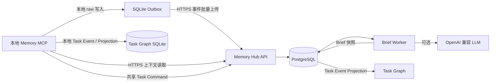

# Memory Hub 设计与部署说明

> 状态：已实现并通过本地、容器与 HTTPS 健康检查。本文描述当前已交付的
> `memory_hub`；实际域名、项目 ID、Token、证书和 LLM 凭证只保存在被 Git
> 忽略的本机文件中，不应写入本文或提交到仓库。

## 1. 定位

Memory Hub 是本地 Memory MCP 的可选 HTTPS 共享事件服务。它不取代本地
Markdown 真源、SQLite 索引或本地任务上下文：未配置 Hub 时，
`memory_read` 和 `memory_write` 保持离线可用，也不会发起网络请求。

启用 Hub 后，普通 Memory 写入仍先进入本地 Outbox 并由后台线程异步上传；网络、远端鉴权或
远端处理失败不会阻塞这些本地写入。共享 Task Graph 的协调命令是例外：本地 MCP 先请求 Hub
进行 version / epoch 裁决，只有 Hub 接受才提交本地 Task Event；离线时只允许 `report` 与
`submit` 作为待同步记录。

## 2. 架构



生产 Compose 栈包含四个服务：

| 服务 | 职责 | 网络边界 |
|---|---|---|
| `caddy` | TLS、HTTP 到 HTTPS 重定向、反向代理 | 唯一暴露 `80/443` 的服务 |
| `api` | 鉴权、事件接收、上下文读取、迁移 | 仅 Compose 私有网络 |
| `worker` | 异步生成用户与项目 Brief | 仅 Compose 私有网络 |
| `postgres` | 事件、Token 哈希、Job、Brief 快照 | 仅 Compose 私有网络 |

## 3. 数据与处理模型

1. 本地客户端以版本化 JSON 合约调用 `POST /v1/projects/{project_id}/events/batch`。
2. API 从 Bearer Token 推导 `user_id`、`project_id` 与权限；请求正文不能决定身份。
3. 事件按 `(project_id, event_id)` 幂等。相同内容重复上传返回 duplicate，不同内容复用同一 ID 会被拒绝。
4. 成功事件写入 append-only `memory_events`，并标记用户与项目 Brief Job 为 dirty。
5. Worker 使用带租约的 Job 领取、退避重试和水位线处理，生成 `user_recent` 与 `project_recent` 快照。
6. 共享 Task 命令在同一事务中写入 Task Event 并更新 Task Graph Projection。
7. API 从当前 Brief Head 和可见事件提供 `POST /v1/projects/{project_id}/context`。

Brief 是可重建的派生视图，不是事件真源。Worker 失败时保留旧 Head；项目 Brief 不向其他用户暴露个人范围的事件正文。

### 3.1 Task Graph

Task Graph 是唯一的执行图投影。每个 `task_sync` 外层事件包含经过严格校验的内层 Task Event；
Hub 从 Token 绑定项目与权限，并要求内外 `task_id`、Agent ID 一致。该检查只保证事件封装
一致性，不能替代 Token 级 Agent 身份认证。
一次成功 ingest 在同一数据库事务中写入 `memory_events`、append-only `task_events`，校验
`command_id`、expected version 与 assignment epoch，更新 Task/Attempt/Submission/Review
Projection，并刷新 Graph Bundle 节点与边。`TaskEvent` 同时记录预期和实际 version/epoch，
因此同一 command 的变形重放不会被当作成功重复。

Task Graph 端点为 `GET /v1/projects/{project_id}/task-graph` 与
`GET /v1/projects/{project_id}/task-events`，均受 `context:read` 和项目范围校验。Graph Bundle
固定返回 `roots`、`nodes`、`edges` 与 `cursor`；`agent_id` 仅匹配当前 Attempt 的 assignee。
`/shared` 的任务工作区通过这两个端点渲染状态队列、选中任务的局部轨迹、Agent 负载、详情和
Timeline。

在 Hub 共享模式，协调命令同步调用已有的 batch event endpoint，避免异步 Outbox 把过期的
claim/review/reassign 伪装为有效；Hub 不可用时只有 `report` / `submit` 可本地追加并在恢复后
同步。普通 Memory 写入仍保持异步本地优先，不受此规则影响。

### 3.2 响应与 Token 预算

服务端在数据源和 MCP 边界实施两层限制。Hub Feed 默认 20 项、最大 50 项，事件正文为
512 字符预览；Board 默认 20 项、最大 50 项，正文为 512 字符预览且省略 references；
Context 默认 10 项、最大 20 项且最多 6 个 include 区段。完整正文、structured brief 和 Board
references 都是显式 opt-in，Web 面板自行请求 UI 所需的 Task Graph 与事件详情。

MCP dispatcher 对所有扩展参数做运行时 clamp，最终序列化边界再限制为 12,000 字符和保守
估算 3,000 tokens。超限响应递归削减列表、字段、字符串与深度，但保持有效 JSON 和核心
状态字段。该治理仅限制派生视图和传输，不删除 append-only Event 历史；大型项目通过任务、
Agent、时间窗口和分次查询控制工作集，Task Graph 不进入自动 task-context 注入路径。

外部 LLM Brief 另有独立的成本控制，不与读取响应预算混用：只在最后一个相关事件后的
尾随去抖窗口结束时生成，单次 prompt 按保守估算裁剪为不超过
`BRIEF_PROMPT_TOKEN_BUDGET`（默认 6,000），Provider 请求显式限制
`BRIEF_OUTPUT_TOKEN_BUDGET`（默认 800）。每个项目每日共享
`BRIEF_DAILY_TOKEN_BUDGET`（默认 100,000）的持久化预留额度；预约在请求前通过
行锁完成，失败调用不退回额度，确保并发 Worker 与失败重试都不能绕过上限。连续失败达到
`BRIEF_MAX_ATTEMPTS`（默认 5）后 Job 进入 `failed`，直到新的相关事件到达后才会重新激活。

## 4. 安全边界

- Token 格式为 `mem_v1.<token-id>.<secret>`，服务端只保存 secret hash，明文只在创建时出现一次。
- Token 仅授予所需 scope，通常为 `events:write` 与 `context:read`；丢失或泄露时创建替代 Token 并撤销旧 `token_id`。
- 事件正文经过敏感信息检测；命中私钥、常见 API Key、Bearer Token、数据库 URL、AWS Key、Slack Token 或 JWT 特征时，正文不持久化。
- 上下文 API 只返回白名单 metadata 字段；个人 scope 不会被用于他人的项目 Brief。
- `.env`、`user_config.local.json`、证书、私钥、CSR 均必须被 Git 忽略。发布前运行根目录的 `scripts/check_public_tree.py`。
- LLM Provider 只接收 Worker 允许的 Brief 输入，不能执行工具、命令、URL 或代码。未配置真实 LLM 时使用 `fake` Provider，基础同步仍可用。

## 5. 中文部署步骤

### 5.1 前置条件

- Docker Compose 可用。
- DNS 已将目标域名解析到服务器。
- 防火墙或安全组已开放 TCP `80`、`443`。
- 将签发的 `<public-hostname>.crt` 与 `<public-hostname>.key` 放进 `memory_hub/certs/`。

### 5.2 初始化

在 `memory_hub/` 目录执行，项目 ID 必须显式指定：

```bash
./bootstrap.sh memory.example.com <project-id> <user-id>
```

Bootstrap 会：

1. 创建受限权限的 `.env`，其中包含随机 PostgreSQL 内部密码。
2. 组装 `fullchain.pem` 与 `privkey.pem` 并验证证书链。
3. 以 `<project-id>` 作为 Compose 项目名构建并等待服务健康。
4. 在仓库根目录生成权限为 `0600` 的 `user_config.local.json`，其中包含一次性创建的最小权限 Token。

重复运行不会覆盖已有的 `user_config.local.json`，也不会额外创建活动 Token。证书要求见 [`certs/README.md`](certs/README.md)。

### 5.3 验证与日常运维

```bash
# 容器状态
docker compose -p <project-id> ps

# HTTPS 健康检查
curl --fail https://memory.example.com/healthz

# 关注服务日志
docker compose -p <project-id> logs -f api worker caddy

# 备份 PostgreSQL
docker compose -p <project-id> exec -T postgres \
  pg_dump -U memory_hub memory_hub > memory-hub-backup.sql
```

销毁所有服务数据是不可逆操作：

```bash
docker compose -p <project-id> down -v
```

## 6. 本地 MCP 接入

复制根目录的 `user_config.example.json` 为被忽略的 `user_config.local.json`，填写 Hub 地址、项目 ID 和 Token。也可使用环境变量 `MEMORY_HUB_TOKEN` 临时覆盖文件 Token。

完整配置必须同时满足 `enabled=true`、非空 URL、项目 ID 和有效 Token；任一项缺失时同步保持禁用。详细字段及本地离线行为见根目录 [`README.md`](../README.md)。

## 7. 可选 LLM Brief

Worker 默认使用 `LLM_PROVIDER=fake`，不会调用外部模型。要启用 OpenAI 兼容 API，仅在被忽略的 `.env` 中配置：

```env
LLM_PROVIDER=openai_compatible
LLM_BASE_URL=https://provider.example.com/v1
LLM_API_KEY=<secret>
LLM_MODEL=<model-name>
```

更新后重建 Worker：

```bash
docker compose -p <project-id> up -d --force-recreate worker
```

不要将 `LLM_API_KEY` 放入 README、Git、MCP 配置或 `user_config.local.json`。

## 8. 当前实现进展

| 能力 | 状态 |
|---|---|
| HTTPS API、手工证书链、Caddy 反向代理 | 已完成 |
| PostgreSQL 事件持久化与幂等写入 | 已完成 |
| Token 哈希、scope 鉴权、撤销与列表 CLI | 已完成 |
| 本地 Outbox 异步上传、部分确认重试、认证失败停重试 | 已完成 |
| 用户/项目 Brief Job、租约、重试、水位线与 Head upsert | 已完成 |
| 事件正文脱敏、metadata 白名单、个人范围隔离 | 已完成 |
| `fake` 与 OpenAI 兼容 Brief Provider | 已完成 |
| Docker Compose、健康检查、备份命令与自动本机配置生成 | 已完成 |
| 多节点高可用、跨区域复制、分布式共识 | 未实现，且不属于当前设计范围 |
| 单 Hub 事务内的共享 Task Graph version / epoch 裁决 | 已完成；不引入心跳、租约、锁或强一致分布式任务状态机 |

当前验证覆盖 Hub 单元/集成/Worker 测试、本地 MCP 同步测试、公开树审计、TLS 与 HTTPS 健康检查。真实部署的运行日志和数据库只应包含运行态信息，不应被复制进仓库文档。